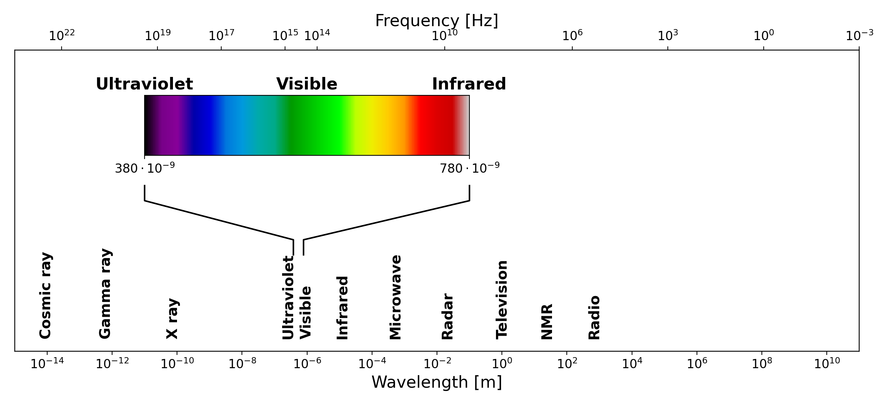

# Theoretical Background

## Spectroscopy in General

Spectroscopy is the branch of science concerned with the interaction between electromagnetic radiation and matter. When light encounters a substance, several things can happen: it may be transmitted, reflected, scattered, or absorbed, depending on the nature of the material and the wavelength of the radiation. Spectroscopy exploits these interactions to obtain information about the physical and chemical properties of substances. Different regions of the electromagnetic spectrum give rise to different types of spectroscopic techniques. X-ray spectroscopy probes the inner electrons of atoms, infrared spectroscopy reveals molecular vibrations, and UV-visible spectroscopy, which is the focus of this work, involves transitions between electronic energy levels [1].

*The electromagnetic spectrum, showing the full range of radiation from cosmic rays to radio waves. The visible region, spanning approximately 380 to 780 nm, is highlighted with its characteristic color gradient. Both wavelength and frequency scales are shown*

The electromagnetic spectrum spans an enormous range of wavelengths and frequencies, from very short gamma rays at one extreme to long radio waves at the other. The UV-visible region occupies only a small portion of this spectrum, roughly from 190 nm to 800 nm, but it is particularly important because the energy of photons in this range corresponds to the energy differences between electronic states in many molecules. When a photon of the right energy strikes a molecule, it can be absorbed, promoting an electron from a lower energy level to a higher one. The wavelengths at which this absorption occurs are characteristic of the molecular structure, making UV-visible spectroscopy a powerful tool for both qualitative identification and quantitative analysis of chemical substances \[1\].

## Absorption (UV/Vis) Spectroscopy

The quantitative foundation of absorption spectrophotometry is the Beer-Lambert law, which describes the relationship between the concentration of an absorbing substance and the amount of light it absorbs. To understand it, consider a beam of monochromatic light passing through a solution of an absorbing compound held in a transparent container called a cuvette. Some of the light will be absorbed by the molecules in solution, and the rest will be transmitted through to the detector.

The transmittance $T$ of the solution is defined as the ratio of the transmitted light intensity I to the incident light intensity $I_0$:
$$T=\frac{I}{I_0}$$
Transmittance is often expressed as a percentage. However, for analytical purposes, it is more convenient to work with the absorbance $A$, defined as the negative logarithm of the transmittance:
$$A=-\log_{10}(T)=\log_{10}\left(\frac{I_0}{I} \right)$$
The Beer-Lambert law states that the absorbance is directly proportional to both the concentration of the absorbing species and the path length of the light through the sample:
$$A=\varepsilon\cdot l\cdot c$$
where $\varepsilon$ is the molar absorptivity (also called the molar extinction coefficient), a constant characteristic of the absorbing substance at a given wavelength, $l$ is the path length of the light through the sample (typically 1 cm in standard cuvettes), and $c$ is the concentration of the absorbing species. The molar absorptivity has units of $\text{L mol}^{-1} \text{cm}^{-1}$ and can vary enormously between different compounds and different wavelengths \[1\].

*Schematic illustration of the Beer-Lambert law. A beam of incident light with intensity $I_0$ passes through a sample of path length $l$, emerging with reduced intensity $I$ due to absorption by the medium.*

The Beer-Lambert law is the cornerstone of quantitative spectrophotometry. If the molar absorptivity of a substance is known, measuring the absorbance of a solution immediately gives its concentration. In practice, a calibration curve is often constructed by measuring the absorbance of a series of solutions with known concentrations, and the unknown concentration is then read off from this curve. The law holds well at low to moderate concentrations, but deviations can occur at high concentrations, where interactions between molecules begin to affect the absorption behavior, or when the incident light is not truly monochromatic \[1\].

*Left: example absorption spectra of a colored solution at five different concentrations, illustrating the characteristic shape of an absorption band and the increase in absorbance with concentration. Right: absorbance as a function of concentration at six specific wavelengths, illustrating the linear relationship predicted by the Beer-Lambert law.*

### Absorption Spectra and Molecular Structure

When the absorbance of a substance is measured not just at a single wavelength but across a range of wavelengths, the result is an absorption spectrum (a plot of absorbance as a function of wavelength). Each substance has a characteristic absorption spectrum that reflects its molecular structure, specifically the energies of its electronic transitions. The wavelength at which the absorbance reaches its maximum is called $\lambda_{max}$, and quantitative measurements are most sensitive at this wavelength, since small changes in concentration cause the largest changes in absorbance \[1\].

The shape and position of absorption bands in the UV-visible spectrum depend on the electronic structure of the molecule. In organic molecules, the electrons most likely to be involved in UV-visible absorption are the $\pi$ electrons in conjugated systems and the non-bonding lone pair electrons on heteroatoms such as oxygen and nitrogen. As the degree of conjugation in a molecule increases, the energy gap between the ground state and the excited state decreases, and the absorption band shifts to longer wavelengths: a phenomenon known as a bathochromic or red shift. This is why, for example, beta-carotene, which has a long conjugated chain, absorbs strongly in the visible region and appears orange, while simpler molecules with fewer conjugated bonds absorb in the UV and are colorless \[1\].

### Structure and Operation of Absorption Spectrometers

A UV-visible absorption spectrophotometer is an instrument designed to measure the absorbance of a sample as a function of wavelength. Despite the many variations in design and complexity that exist, all spectrophotometers share the same fundamental architecture, consisting of five basic components: a light source, a wavelength selector, a sample holder, a detector, and a readout system \[1\].

*Block diagram of the fundamental components of a single-beam absorption spectrophotometer: a light source, a monochromator for wavelength selection, a sample holder, and a detector.*

The light source must emit radiation across the entire wavelength range of interest with sufficient and stable intensity. For UV-visible spectrophotometry, two types of lamps are commonly used in commercial instruments: a deuterium lamp, which provides continuous radiation in the UV region (190–400 nm), and a tungsten-halogen lamp, which covers the visible and near-infrared region (350–900 nm). Many instruments automatically switch between the two lamps as the wavelength scan crosses the boundary between the UV and visible regions. In lower-cost and educational instruments, white LEDs are a popular alternative, as they are inexpensive, energy-efficient, and emit across much of the visible range, though with a non-uniform spectral output \[1\]\[3\].

The wavelength selector is the component responsible for isolating a narrow band of wavelengths from the broadband output of the light source. In modern spectrophotometers, this is almost always achieved using a diffraction grating (a flat optical surface ruled with a large number of closely spaced parallel grooves). When light strikes the grating, it is diffracted at angles that depend on its wavelength according to the grating equation:
$$n\lambda=d\sin \theta$$
where $n$ is the diffraction order (typically 1), $\lambda$ is the wavelength of the diffracted light, $d$ is the spacing between adjacent grooves, and $\theta$ is the diffraction angle. By rotating the grating or scanning the detector angle, different wavelengths can be directed onto the sample in sequence, allowing a full spectrum to be recorded. Older instruments used prisms as dispersive elements, but gratings have largely replaced them due to their more linear dispersion and lower cost \[1\].

The sample holder is typically a cuvette — a small transparent container with a precisely defined path length, usually 1 cm. Cuvettes for UV measurements must be made from materials that do not absorb UV radiation, such as quartz or fused silica. For measurements confined to the visible region, less expensive plastic or glass cuvettes are perfectly adequate \[1\].

The detector converts the transmitted light intensity into an electrical signal. The most common detector type in modern instruments is the photodiode, which generates a current proportional to the incident light intensity. In instruments designed to record a full spectrum simultaneously, an array of photodiodes (known as a photodiode array or PDA) can be used, replacing the need to scan through wavelengths mechanically. Photomultiplier tubes (PMTs), which offer much higher sensitivity, are used in high-end research instruments. For educational and low-cost devices, simpler detectors such as light-dependent resistors (LDRs) or phototransistors are also viable options \[1\]\[3\].

Finally, the readout system processes the electrical signal from the detector and presents the result to the user. In modern instruments this is handled entirely by software running on a connected computer, which can display the spectrum, perform baseline corrections, and carry out quantitative calculations automatically. In simpler home-built instruments, the detector signal is often read directly with a digital multimeter and the absorbance calculated by hand or with a simple script \[1\]\[8\].

It is worth noting the distinction between single-beam and double-beam instrument designs. In a single-beam spectrophotometer, the sample and the blank (a reference solution, typically the pure solvent) are measured sequentially, and the ratio of their signals gives the transmittance. In a double-beam instrument, the light is split into two paths (one through the sample and one through the reference) and both are measured simultaneously. The double-beam design is more stable against fluctuations in the light source intensity and is therefore preferred in research-grade instruments, although single-beam designs are perfectly adequate for many educational and routine analytical applications \[1\].